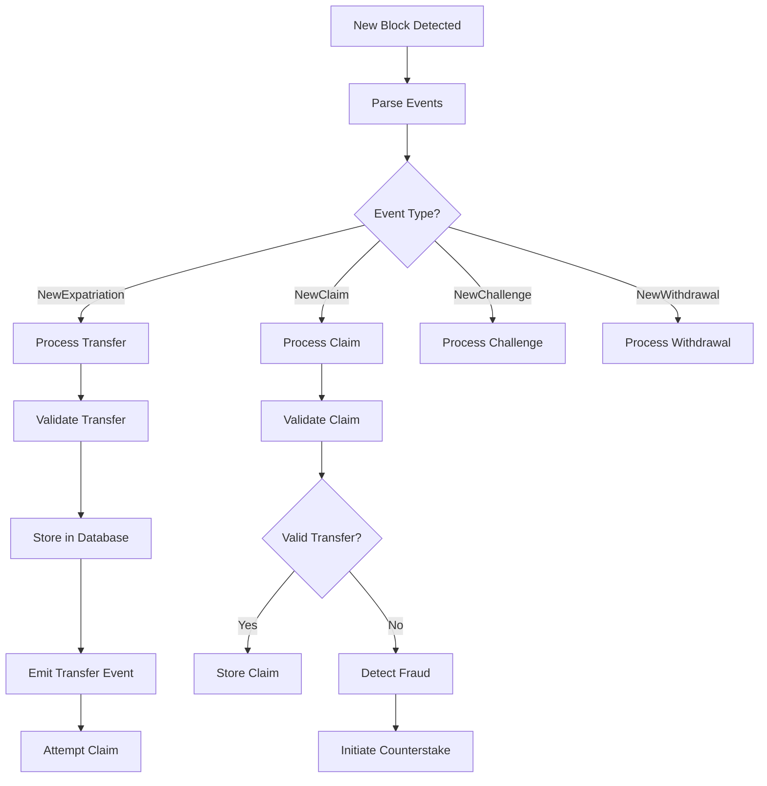

# Counterstake Bridge Watchdog Node Flow

This document describes the complete internal flow and operational logic of the Counterstake bridge watchdog node, which monitors cross-chain bridges between different blockchain networks (Obyte, Ethereum, BSC, Polygon, Kava, 3DPass) and provides security through the counterstake mechanism.

## System Architecture Overview

The watchdog node is a sophisticated multi-network monitoring system that operates as both a **security guardian** and **assistance provider** for cross-chain transfers. It consists of several interconnected components that work together to ensure the integrity of bridge operations.

```
┌─────────────────┐    ┌─────────────────┐    ┌─────────────────┐
│   Network APIs  │    │   Event System  │    │   Database      │
│                 │    │                 │    │                 │
│ • Obyte         │◄──►│ • Event Bus     │◄──►│ • Transfers     │
│ • Ethereum      │    │ • Mutex Locks   │    │ • Claims        │
│ • BSC           │    │ • Timeouts      │    │ • Challenges    │
│ • 3DPass        │    │ • Retries       │    │ • Bridges       │
│ • Polygon       │    │                 │    │ • Assistants    │
│ • Kava          │    │                 │    │                 │
└─────────────────┘    └─────────────────┘    └─────────────────┘
         │                       │                       │
         ▼                       ▼                       ▼
┌─────────────────┐    ┌─────────────────┐    ┌─────────────────┐
│  Transfer Logic │    │  Claim Logic    │    │  Attack Logic   │
│                 │    │                 │    │                 │
│ • Validation    │    │ • Verification  │    │ • Fraud Detect  │
│ • Processing    │    │ • Assistance    │    │ • Counterstake  │
│ • Database      │    │ • Rewards       │    │ • Resolution    │
│ • Events        │    │ • Pooling       │    │ • Notifications │
└─────────────────┘    └─────────────────┘    └─────────────────┘
```

## 1. Node Initialization Flow

### 1.1 Entry Point (`run.js`)

```javascript
// Main entry point - waits for headless wallet to be ready
eventBus.on('headless_wallet_ready', async () => {
    await db_import.initDB();           // Initialize database
    await operator.start();             // Start Obyte operator
    chat.start();                       // Start admin chat interface
    await transfers.start();            // ← MAIN WATCHDOG STARTS HERE
    if (conf.webPort) webserver.start(); // Start web interface
    if (conf.bTrackStats) stats.start(); // Start statistics tracking
});
```

### 1.2 Network API Initialization (`transfers.js`)

```javascript
async function start() {
    // Initialize network APIs based on configuration
    networkApi.Obyte = new Obyte();
    if (!process.env.testnet)
        networkApi.Ethereum = new Ethereum();
    if (!conf.disableBSC)
        networkApi.BSC = new BSC();
    if (!conf.disableThreeDPass)
        networkApi.ThreeDPass = new ThreeDPass(); // ← 3DPass integration
    if (!conf.disablePolygon)
        networkApi.Polygon = new Polygon();
    if (!conf.disableKava)
        networkApi.Kava = new Kava();

    // Load bridge configurations from database
    const bridges = await db.query("SELECT * FROM bridges");
    
    // Set up monitoring for each bridge
    for (let bridge of bridges) {
        const { bridge_id, home_network, export_aa, export_assistant_aa, 
                foreign_network, import_aa, import_assistant_aa } = bridge;
        
        // Skip if networks not available
        if (!networkApi[home_network] || !networkApi[foreign_network]) {
            console.log(`skipping bridge ${bridge_id} ${home_network}->${foreign_network} as one of networks is not available`);
            continue;
        }
        
        // Start watching contract addresses
        if (export_aa)
            networkApi[home_network].startWatchingExportAA(export_aa);
        if (import_aa)
            networkApi[foreign_network].startWatchingImportAA(import_aa);
        if (export_assistant_aa)
            networkApi[home_network].startWatchingExportAssistantAA(export_assistant_aa);
        if (import_assistant_aa)
            networkApi[foreign_network].startWatchingImportAssistantAA(import_assistant_aa);
    }
}
```

### 1.3 Network-Specific Setup

Each network class (Ethereum, BSC, 3DPass, etc.) extends the base `EvmChain` class:

```javascript
// threedpass.js - 3DPass network implementation
class ThreeDPass extends EvmChain {
    constructor() {
        if (bCreated)
            throw Error("ThreeDPass class already created, must be a singleton");
        bCreated = true;
        
        const provider = getProvider('3DPass');
        super('3DPass', conf.threedpass_factory_contract_addresses, 
              conf.threedpass_assistant_factory_contract_addresses, provider);
    }

    getNativeSymbol() { return 'P3D'; }
    getMaxBlockRange() { return 1000; }
    
    async getAddressBlocks(address, startblock) {
        return await getAddressBlocks({ address, startblock });
    }
}
```

## 2. Event Monitoring & Detection

### 2.1 Multi-Network Event Listening

Each network API implements comprehensive event monitoring:

```javascript
// evm-chain.js - Base EVM chain monitoring
class EvmChain {
    async startWatchingExportAA(export_aa) {
        // Watch for NewExpatriation events
        this.contractsByAddress[export_aa] = new ethers.Contract(
            export_aa, exportJson.abi, this.provider
        );
        
        this.contractsByAddress[export_aa].on('NewExpatriation', 
            (sender_address, amount, reward, foreign_address, data, event) => {
                this.handleNewExpatriation(export_aa, sender_address, amount, 
                                         reward, foreign_address, data, event);
            });
    }
    
    async startWatchingImportAA(import_aa) {
        // Watch for NewClaim events
        this.contractsByAddress[import_aa] = new ethers.Contract(
            import_aa, importJson.abi, this.provider
        );
        
        this.contractsByAddress[import_aa].on('NewClaim', 
            (claim_num, sender_address, dest_address, claimant_address, 
             data, amount, reward, stake, txid, txts, event) => {
                this.handleNewClaim(import_aa, claim_num, sender_address, 
                                  dest_address, claimant_address, data, 
                                  amount, reward, stake, txid, txts, event);
            });
    }
}
```

### 2.2 Event Processing Flow



## 3. Transfer Processing Logic

### 3.1 Transfer Detection & Storage

```javascript
// transfers.js - Transfer processing
async function addTransfer(transfer) {
    const { bridge_id, type, amount, reward, sender_address, 
            dest_address, data, txid, txts } = transfer;
    
    // Handle rewritable ledgers (Ethereum, BSC, 3DPass)
    if (bRewritable) {
        const db_transfers = await db.query(
            "SELECT * FROM transfers WHERE txid=? AND txts=? AND bridge_id=? AND amount=? AND reward=? AND sender_address=? AND dest_address=? AND data=?", 
            [txid, txts, bridge_id, amount.toString(), reward.toString(), 
             sender_address, dest_address, data]
        );
        
        // Handle reorgs - re-confirm existing transfers
        if (db_transfers.length > 0 && !db_transfers[0].is_confirmed) {
            await db.query("UPDATE transfers SET is_confirmed=1 WHERE transfer_id=?", 
                          [db_transfers[0].transfer_id]);
            return console.log(`re-confirmed the existing transfer ${db_transfers[0].transfer_id}`);
        }
    }
    
    // Insert new transfer
    const res = await db.query(
        "INSERT INTO transfers (bridge_id, type, amount, reward, sender_address, dest_address, data, txid, txts) VALUES (?,?, ?,?, ?,?,?, ?,?)", 
        [bridge_id, type, amount.toString(), reward.toString(), 
         sender_address, dest_address, data, txid, txts]
    );
    
    // Emit event for claim processing
    eventBus.emit(txid);
    
    // Handle transfer if not in catchup mode
    if (!bCatchingUp && res.insertId) {
        await handleTransfer(transfer);
    }
}
```

### 3.2 Transfer Validation

```javascript
async function handleTransfer(transfer) {
    const { bridge_id, type, sender_address, dest_address, data, txid, txts, transfer_id } = transfer;
    let { amount, reward } = transfer;

    // Validate amounts
    if (typeof reward === 'number' && !validationUtils.isInteger(reward))
        return markAsBad(`invalid reward ${reward} in transfer ${txid}`);
    
    if (!BigNumber.isBigNumber(amount)) amount = BigNumber.from(amount);
    if (!BigNumber.isBigNumber(reward)) reward = BigNumber.from(reward);
    
    // Get bridge configuration
    const bridge = await getBridge(bridge_id);
    const { export_aa, import_aa, export_assistant_aa, import_assistant_aa, 
            home_asset, foreign_asset, stake_asset, home_network, foreign_network, 
            home_asset_decimals, foreign_asset_decimals, home_symbol, foreign_symbol } = bridge;
    
    // Check bridge completeness
    const bCompleteBridge = import_aa && export_aa;
    if (!bCompleteBridge)
        return console.log(`will not claim transfer ${txid} as bridge is incomplete`);
    
    // Determine networks and assets
    const src_network = type === 'expatriation' ? home_network : foreign_network;
    const dst_network = type === 'expatriation' ? foreign_network : home_network;
    const bridge_aa = type === 'expatriation' ? import_aa : export_aa;
    const assistant_aa = type === 'expatriation' ? import_assistant_aa : export_assistant_aa;
    
    // Validate amounts match across networks
    const dst_amount = getDestAmount(amount, src_asset_decimals, dst_asset_decimals);
    const dst_reward = getDestAmount(reward, src_asset_decimals, dst_asset_decimals);
    
    if (!amountsMatch(amount, src_asset_decimals, dst_amount, dst_asset_decimals))
        return markAsBad(`transfer amounts do not match: src ${amount} dst ${dst_amount}`);
    
    // Check if claiming for self or others
    const bThirdPartyClaiming = !dst_api.isMyAddress(dest_address);
    
    if (bThirdPartyClaiming) {
        // Validate reward requirements for third-party claiming
        if (reward.lt(0)) return; // Negative reward = no third-party claiming
        if (reward.isZero()) return; // Zero reward = not worth claiming
        
        const fAmount = parseFloat(utils.formatEther(amount));
        const fReward = parseFloat(utils.formatEther(reward));
        
        // Check minimum reward ratio
        if (fReward < conf.min_reward_ratio * fAmount) return;
        
        // Check minimum reward for fees
        const fMinReward = await dst_api.getMinReward(type, claimed_asset, src_network, src_asset, !!assistant_aa);
        if (fDstReward < fMinReward) return;
        
        // Check net reward after fees
        const fDstNetReward = fDstReward - fMinReward;
        if (fDstNetReward < conf.min_reward_ratio * fDstAmount) return;
    }
    
    // Attempt to claim the transfer
    await sendClaim();
}

## 4. Claim Processing & Assistance

### 4.1 Claim Decision Logic

```javascript
const sendClaim = async () => {
    const unlock = await mutex.lock(dst_network);
    console.log(`will claim transfer on ${dst_network} from ${sender_address} amount ${dst_amount} reward ${dst_reward} txid ${txid}`);

    // Verify transfer still exists and is confirmed
    let db_transfers = await db.query(
        "SELECT * FROM transfers WHERE txid=? AND bridge_id=? AND amount=? AND reward=? AND sender_address=? AND dest_address=? AND data=?", 
        [txid, bridge_id, amount.toString(), reward.toString(), sender_address, dest_address, data]
    );
    
    if (db_transfers.length !== 1) {
        db_transfers = db_transfers.filter(t => t.is_confirmed);
        if (db_transfers.length !== 1)
            throw Error(`${db_transfers.length} confirmed transfers found for tx ${txid}`);
    }
    
    const [{ transfer_id, is_confirmed }] = db_transfers;
    if (!is_confirmed)
        return unlock(`transfer ${txid} got removed, will not claim`);

    // Check if already claimed
    const [db_claim] = await db.query("SELECT * FROM claims WHERE transfer_id=?", [transfer_id]);
    if (db_claim)
        return unlock(`transfer ${txid} #${transfer_id} already claimed`);
    
    if (unconfirmedClaims[transfer_id])
        return unlock(`already claimed transfer ${txid} #${transfer_id} in tx ${unconfirmedClaims[transfer_id].claim_txid}`);
    
    // Calculate required stake
    let stake = await dst_api.getRequiredStake(bridge_aa, dst_amount);
    stake = BigNumber.from(stake);
    
    // Add 10% buffer for Obyte (oracle price changes)
    if (type === 'expatriation' && dst_network === 'Obyte')
        stake = stake.mul(110).div(100);
    
    // Try to claim from assistant first
    let bClaimFromPooledAssistant = !!assistant_aa;
    if (bClaimFromPooledAssistant) {
        const bAssistantHasEnoughBalance = (staked_asset === claimed_asset)
            ? dst_amount.add(stake).lt(await dst_api.getBalance(assistant_aa, staked_asset))
            : (stake.lt(await dst_api.getBalance(assistant_aa, staked_asset))
                && dst_amount.lt(await dst_api.getBalance(assistant_aa, claimed_asset)));
        
        if (bAssistantHasEnoughBalance) {
            console.log(`will claim ${txid} from assistant AA ${assistant_aa}`);
        } else {
            console.log(`assistant AA ${assistant_aa} has insufficient balance, will try to claim myself`);
            bClaimFromPooledAssistant = false;
        }
    }
    
    // Check own balance if not using assistant
    if (!bClaimFromPooledAssistant) {
        const bHaveEnoughBalance = bThirdPartyClaiming
            ? ((staked_asset === claimed_asset)
                ? dst_amount.add(stake).lte(await dst_api.getMyBalance(staked_asset))
                : (stake.lte(await dst_api.getMyBalance(staked_asset))
                    && dst_amount.lte(await dst_api.getMyBalance(claimed_asset))))
            : stake.lte(await dst_api.getMyBalance(staked_asset));
        
        if (!bHaveEnoughBalance) {
            return unlock(`insufficient balance to claim transfer ${txid}`);
        }
    }
    
    // Send the claim transaction
    const claim_txid = await dst_api.claim(bridge_aa, assistant_aa, {
        transfer_id, bridge_id, type, sender_address, dest_address, 
        data, dst_amount, dst_reward, stake
    });
    
    // Track unconfirmed claim
    unconfirmedClaims[transfer_id] = { claim_txid, ts: Date.now() };
    
    unlock();
};
```

### 4.2 Assistant Integration

The watchdog can use pooled assistant contracts to claim transfers:

```javascript
// Assistant contract interaction
async function claimFromAssistant(assistant_aa, bridge_aa, claim_data) {
    const assistantContract = new ethers.Contract(
        assistant_aa, exportAssistantJson.abi, this.wallet
    );
    
    // Call assistant's claim function
    const tx = await assistantContract.claim(
        bridge_aa,
        claim_data.transfer_id,
        claim_data.sender_address,
        claim_data.dest_address,
        claim_data.data,
        claim_data.amount,
        claim_data.reward,
        { gasLimit: 500000 }
    );
    
    return await tx.wait();
}
```

## 5. Fraud Detection & Counterstake Logic

### 5.1 Claim Validation Process

```javascript
async function handleNewClaim(bridge, type, claim_num, sender_address, dest_address, 
                            claimant_address, data, amount, reward, stake, txid, txts, claim_txid) {
    
    if (!conf.bWatchdog)
        return console.log(`will skip claim ${claim_txid} as watchdog function is off`);

    const network = type === 'expatriation' ? bridge.foreign_network : bridge.home_network;
    const unlock = await mutex.lock(network);
    console.log(`handling claim ${claim_num} in tx ${claim_txid}`);

    // Check for duplicate claims
    const [db_claim] = await db.query(
        "SELECT * FROM claims WHERE claim_num=? AND bridge_id=? AND type=?", 
        [claim_num, bridge.bridge_id, type]
    );
    if (db_claim)
        return unlock(`duplicate claim ${claim_num} in tx ${claim_txid}`);

    // Ensure opposite network is synced
    const opposite_network = type === 'expatriation' ? bridge.home_network : bridge.foreign_network;
    if (!networkApi[opposite_network])
        return unlock(`opposite network ${opposite_network} not active, ignoring claim ${claim_txid}`);
    
    await networkApi[opposite_network].waitUntilSynced();
    
    // Find matching transfer
    const findTransfers = async () => {
        const transfers = await db.query(
            "SELECT * FROM transfers WHERE bridge_id=? AND txid=? AND txts=? AND sender_address=? AND dest_address=? AND type=? AND is_confirmed=1", 
            [bridge_id, txid, txts, sender_address, dest_address, type]
        );
        console.log(`transfer candidates for ${txid}`, transfers);
        return transfers;
    };
    
    let transfers = await findTransfers();
    
    // Validate claim against transfer
    const checkTransfer = (transfer) => {
        if (!networkApi[network].dataMatches(transfer.data, data)) {
            console.log(`data strings do not match in claim ${claim_num}`);
            return false;
        }
        
        const src_asset_decimals = type === 'expatriation' ? home_asset_decimals : foreign_asset_decimals;
        const dst_asset_decimals = type === 'expatriation' ? foreign_asset_decimals : home_asset_decimals;
        
        if (!amountsMatch(transfer.amount, src_asset_decimals, amount, dst_asset_decimals)) {
            console.log(`transfer amounts do not match in claim ${claim_num}`);
            return false;
        }
        
        if (!amountsMatch(transfer.reward, src_asset_decimals, reward, dst_asset_decimals)) {
            console.log(`transfer rewards do not match in claim ${claim_num}`);
            return false;
        }
        
        return true;
    };
    
    transfers = transfers.filter(checkTransfer);
    
    // If no valid transfer found → FRAUD DETECTED
    if (!transfers[0]) {
        console.log(`FRAUD: no transfer found matching claim ${claim_num}`);
        await attackClaim(bridge, type, claim_num, claim_txid);
        return unlock();
    }
    
    // Store valid claim
    await db.query(
        "INSERT INTO claims (bridge_id, type, claim_num, transfer_id, claimant_address, stake, claim_txid) VALUES (?, ?, ?, ?, ?, ?, ?)", 
        [bridge_id, type, claim_num, transfers[0].transfer_id, claimant_address, stake.toString(), claim_txid]
    );
    
    unlock();
}
```

### 5.2 Counterstake Attack Logic

```javascript
async function attackClaim(bridge, type, claim_num, claim_txid) {
    if (!conf.bWatchdog || !conf.bAttack)
        return console.log(`will skip attacking claim ${claim_txid} as watchdog/attack function is off`);

    const { bridge_id, export_aa, import_aa, export_assistant_aa, import_assistant_aa, 
            home_asset, foreign_asset, stake_asset, home_network, foreign_network } = bridge;
    
    console.log(`will attack ${type} claim ${claim_num} in ${claim_txid} on bridge ${bridge_id}`);
    
    const bCompleteBridge = import_aa && export_aa;
    if (!bCompleteBridge)
        return console.log(`will not attack claim ${claim_num} as bridge is incomplete`);
    
    const bridge_aa = type === 'expatriation' ? import_aa : export_aa;
    const assistant_aa = type === 'expatriation' ? import_assistant_aa : export_assistant_aa;
    
    if (!assistant_aa && !conf.bUseOwnFunds)
        return console.log(`not using own funds, will not attack claim ${claim_num}`);
    
    const network = type === 'expatriation' ? foreign_network : home_network;
    const api = networkApi[network];
    
    // Get claim details
    const claim = await api.getClaim(bridge_aa, claim_num, false, false);
    console.log(`will attack new claim received in trigger ${claim_txid}`, claim);
    
    if (!claim)
        return notifications.notifyAdmin(`ongoing claim ${claim_num} not found, will not attack`);
    
    if (claim.current_outcome !== 'yes') // someone challenged it before us
        return console.log(`claim ${claim_num} already challenged`);
    
    if (claim.expiry_ts < Date.now() / 1000)
        return notifications.notifyAdmin(`challenging period expired in claim ${claim_num}`);
    
    // Calculate required counterstake
    const required_counterstake = BigNumber.from(claim.challenging_target);
    const asset = type === 'expatriation' ? stake_asset : home_asset;
    
    const counterstake = await getCounterstakeAmount(network, assistant_aa, required_counterstake, asset);
    if (counterstake.isZero())
        return notifications.notifyAdmin(`0 balance available to counterstake claim ${claim_num}`);
    
    if (counterstake.lt(required_counterstake))
        notifications.notifyAdmin(`counterstaking ${counterstake} out of ${required_counterstake} on claim ${claim_num}`);
    
    // Send challenge
    await sendChallenge(network, bridge_aa, assistant_aa, { claim_num, bridge_id, type }, 'no', asset, counterstake);
}
```

### 5.3 Challenge Sending

```javascript
async function sendChallenge(network, bridge_aa, assistant_aa, claim_data, outcome, asset, counterstake) {
    const api = networkApi[network];
    const unlock = await mutex.lock(network);
    
    console.log(`will challenge claim ${claim_data.claim_num} on ${network} with outcome ${outcome} counterstake ${counterstake}`);
    
    try {
        const challenge_txid = await api.challenge(bridge_aa, assistant_aa, claim_data, outcome, asset, counterstake);
        
        // Store challenge in database
        await db.query(
            "INSERT INTO challenges (bridge_id, type, claim_num, challenger_address, outcome, counterstake, challenge_txid) VALUES (?, ?, ?, ?, ?, ?, ?)", 
            [claim_data.bridge_id, claim_data.type, claim_data.claim_num, 
             api.getMyAddress(), outcome, counterstake.toString(), challenge_txid]
        );
        
        console.log(`challenge sent: ${challenge_txid}`);
        unlock();
        
    } catch (e) {
        unlock();
        throw e;
    }
}
```

## 6. Configuration & Control System

### 6.1 Key Configuration Parameters

```javascript
// conf.js - Main configuration
exports.bWatchdog = true;           // Enable/disable watchdog functionality
exports.bClaimForOthers = true;     // Allow claiming transfers for others
exports.bUseOwnFunds = true;        // Use own funds when assistant insufficient
exports.bAttack = true;             // Enable counterstake attacks on fraud
exports.min_reward_ratio = 0.005;   // Minimum reward ratio (0.5%)
exports.max_exposure = 0.5;         // Max 50% of balance in counterstake
exports.recheck_timeout = 15 * 60 * 1000; // 15 mins: recheck removed txs

// Network enable/disable flags
exports.disablePolygon = true;
exports.disableKava = true;
exports.disableBSC = false;
exports.disableThreeDPass = false;  // Enable 3DPass monitoring

// 3DPass specific configuration
exports.threedpass_factory_contract_addresses = {
    'v1.1': '0xBDe856499b710dc8E428a6B616A4260AAFa60dd0'
};
exports.threedpass_assistant_factory_contract_addresses = {
    'v1.1': '0x5b74685B32cdaA74a030DA14F15F56CcfB5cA1Bc'
};
exports.threedpass_oracle_addresses = {
    '3DPass': '0xAc647d0caB27e912C844F27716154f54EDD519cE'
};
exports.p3d_precompile_address = '0x0000000000000000000000000000000000000802';
```

### 6.2 Admin Chat Interface

```javascript
// chat.js - Admin commands
eventBus.on('text', async (from_address, text) => {
    if (!headlessWallet.isControlAddress(from_address))
        return sendResponse("This bot can be managed only from control addresses.");
    
    const device = require('ocore/device.js');
    const sendResponse = response => device.sendMessageToDevice(from_address, 'text', response);
    
    if (text === 'help') {
        let lines = [
            "[balances](command:balances) - query the bot's balances;",
            "[deposit <amount> <token>](suggest-command:deposit amount token) - deposit tokens;",
            "[withdraw <amount> <token>](suggest-command:withdraw amount token) - withdraw tokens;",
            "[withdraw all <token>](suggest-command:withdraw all token) - withdraw the entire balance of a token.",
        ];
        return sendResponse(lines.join("\n"));
    }
    
    if (text === 'balances') {
        // Query and display balances across all networks
        let balances = {};
        for (let network in networkApi) {
            balances[network] = await networkApi[network].getBalances();
        }
        return sendResponse(JSON.stringify(balances, null, 2));
    }
});
```

## 7. Continuous Monitoring & Maintenance

### 7.1 Periodic Tasks

```javascript
// transfers.js - start() function
async function start() {
    // ... initialization code ...
    
    // Check unfinished claims every 30 minutes (2 minutes on testnet)
    await checkUnfinishedClaims();
    setInterval(checkUnfinishedClaims, (process.env.testnet || process.env.devnet ? 2 : 30) * 60 * 1000);
    
    // Recheck old transfers every hour
    setTimeout(recheckOldTransfers, 61 * 1000);
    setInterval(recheckOldTransfers, 3600 * 1000);
    
    // Forget old unconfirmed claims every hour
    setInterval(forgetOldUnconfirmedClaims, 3600 * 1000);
    
    // Monitor network disconnections
    setInterval(() => {
        console.log('disconnected networks', disconnected_ts);
        for (let network in disconnected_ts) {
            const elapsed = Date.now() - disconnected_ts[network];
            if (elapsed > 3600_000) // 1 hour
                notifications.notifyAdmin(`${network} disconnected for too long`, 
                                        `${network} disconnected for ${elapsed / 1000}s`);
        }
    }, 3600_000);
}
```

### 7.2 Network Reconnection Logic

```javascript
// Handle network disconnections
eventBus.on('network_disconnected', async (network) => {
    if (!caughtUp[network])
        throw Error(`${network} disconnected before having caught up`);
    
    console.log('will reconnect to', network);
    if (!disconnected_ts[network])
        disconnected_ts[network] = Date.now();
    
    // Recreate network API
    if (network === 'Ethereum')
        networkApi.Ethereum = new Ethereum();
    else if (network === 'BSC')
        networkApi.BSC = new BSC();
    else if (network === '3DPass')
        networkApi.ThreeDPass = new ThreeDPass();
    else if (network === 'Polygon')
        networkApi.Polygon = new Polygon();
    else if (network === 'Kava')
        networkApi.Kava = new Kava();
    else
        throw Error(`unknown network disconnected ${network}`);
    
    // Restart network monitoring
    await restartNetwork(network);
    delete disconnected_ts[network];
});
```

### 7.3 Unfinished Claims Check

```javascript
async function checkUnfinishedClaims() {
    console.log('checking unfinished claims...');
    
    const claims = await db.query(
        "SELECT c.*, b.home_network, b.foreign_network FROM claims c " +
        "JOIN bridges b ON c.bridge_id=b.bridge_id " +
        "WHERE c.is_confirmed=0"
    );
    
    for (let claim of claims) {
        const network = claim.type === 'expatriation' ? claim.foreign_network : claim.home_network;
        const api = networkApi[network];
        
        if (!api) continue;
        
        try {
            const is_confirmed = await api.isTransactionConfirmed(claim.claim_txid);
            if (is_confirmed) {
                await db.query("UPDATE claims SET is_confirmed=1 WHERE claim_id=?", [claim.claim_id]);
                console.log(`confirmed claim ${claim.claim_id}`);
            }
        } catch (e) {
            console.log(`error checking claim ${claim.claim_id}:`, e.message);
        }
    }
}
```

## 8. Database Schema & State Management

### 8.1 Core Tables

```sql
-- Bridge configurations
CREATE TABLE bridges (
    bridge_id INTEGER PRIMARY KEY,
    home_network TEXT NOT NULL,
    home_asset TEXT NOT NULL,
    home_asset_decimals INTEGER,
    home_symbol TEXT,
    export_aa TEXT,
    export_assistant_aa TEXT,
    foreign_network TEXT NOT NULL,
    foreign_asset TEXT NOT NULL,
    foreign_asset_decimals INTEGER,
    foreign_symbol TEXT,
    stake_asset TEXT,
    import_aa TEXT,
    import_assistant_aa TEXT
);

-- Transfer attempts
CREATE TABLE transfers (
    transfer_id INTEGER PRIMARY KEY,
    bridge_id INTEGER NOT NULL,
    type TEXT NOT NULL, -- 'expatriation' or 'repatriation'
    amount TEXT NOT NULL,
    reward TEXT NOT NULL,
    sender_address TEXT NOT NULL,
    dest_address TEXT NOT NULL,
    data TEXT,
    txid TEXT NOT NULL,
    txts INTEGER NOT NULL,
    is_confirmed INTEGER DEFAULT 0,
    is_bad INTEGER DEFAULT 0,
    FOREIGN KEY (bridge_id) REFERENCES bridges(bridge_id)
);

-- Transfer claims
CREATE TABLE claims (
    claim_id INTEGER PRIMARY KEY,
    bridge_id INTEGER NOT NULL,
    type TEXT NOT NULL,
    claim_num INTEGER NOT NULL,
    transfer_id INTEGER NOT NULL,
    claimant_address TEXT NOT NULL,
    stake TEXT NOT NULL,
    claim_txid TEXT NOT NULL,
    is_confirmed INTEGER DEFAULT 0,
    FOREIGN KEY (bridge_id) REFERENCES bridges(bridge_id),
    FOREIGN KEY (transfer_id) REFERENCES transfers(transfer_id)
);

-- Counterstake challenges
CREATE TABLE challenges (
    challenge_id INTEGER PRIMARY KEY,
    bridge_id INTEGER NOT NULL,
    type TEXT NOT NULL,
    claim_num INTEGER NOT NULL,
    challenger_address TEXT NOT NULL,
    outcome TEXT NOT NULL, -- 'yes' or 'no'
    counterstake TEXT NOT NULL,
    challenge_txid TEXT NOT NULL,
    is_confirmed INTEGER DEFAULT 0,
    FOREIGN KEY (bridge_id) REFERENCES bridges(bridge_id)
);

-- Pooled assistant configurations
CREATE TABLE pooled_assistants (
    assistant_id INTEGER PRIMARY KEY,
    bridge_id INTEGER NOT NULL,
    assistant_aa TEXT NOT NULL,
    share_symbol TEXT NOT NULL,
    share_name TEXT NOT NULL,
    FOREIGN KEY (bridge_id) REFERENCES bridges(bridge_id)
);
```

### 8.2 State Tracking

The watchdog maintains several in-memory state variables:

```javascript
// Global state variables
let bCatchingUp = true;                    // During initial sync
let bCatchingUpOrHandlingPostponedEvents = true;
let unconfirmedClaims = {};                // transfer_id => {claim_txid, ts}
let unconfirmeWithdrawals = {};
let maxAmounts;                            // Cached maximum amounts
let caughtUp = {};                         // Network sync status
let disconnected_ts = {};                  // Network disconnection timestamps
```

## 9. Error Handling & Resilience

### 9.1 Retry Logic

```javascript
// Retry mechanism for failed operations
const tryAgain = () => {
    console.log(`retrying handling of claim ${claim_num}`);
    handleNewClaim(bridge, type, claim_num, sender_address, dest_address, 
                  claimant_address, data, amount, reward, stake, txid, txts, claim_txid);
};

// Timeout-based retry
const retryAfterTxOrTimeout = (timeout) => {
    const t = setTimeout(tryAgain, timeout * 1000);
    eventBus.once(txid, () => {
        console.log(`got txid event ${txid}`);
        clearTimeout(t);
        tryAgain();
    });
};
```

### 9.2 Deadlock Prevention

```javascript
// utils.js - Deadlock monitoring
function watchForDeadlock(name) {
    let last_ts = Date.now();
    setInterval(() => {
        const elapsed = Date.now() - last_ts;
        if (elapsed > 300_000) { // 5 minutes
            console.error(`possible deadlock in ${name}, no activity for ${elapsed}ms`);
            notifications.notifyAdmin(`possible deadlock in ${name}`, 
                                    `no activity for ${elapsed}ms`);
        }
    }, 60_000);
}
```

### 9.3 Rate Limiting

```javascript
// Handle rate limit errors
async function handleRateLimitError(error, operation) {
    if (isRateLimitError(error)) {
        console.log(`rate limit hit for ${operation}, waiting 60 seconds`);
        await wait(60_000);
        return true; // Retry
    }
    return false; // Don't retry
}
```

## 10. Performance & Optimization

### 10.1 Batch Processing

```javascript
// Process multiple events efficiently
async function processBatchEvents(events) {
    const batchSize = 10;
    for (let i = 0; i < events.length; i += batchSize) {
        const batch = events.slice(i, i + batchSize);
        await Promise.all(batch.map(event => processEvent(event)));
        await wait(100); // Small delay between batches
    }
}
```

### 10.2 Caching

```javascript
// Cache frequently accessed data
let cachedMinTxAges = {};
let cachedBalances = {};

async function getCachedBalance(network, asset) {
    const key = `${network}_${asset}`;
    if (!cachedBalances[key] || Date.now() - cachedBalances[key].ts > 30000) {
        cachedBalances[key] = {
            balance: await networkApi[network].getMyBalance(asset),
            ts: Date.now()
        };
    }
    return cachedBalances[key].balance;
}
```

## 11. Security Considerations

### 11.1 Input Validation

```javascript
// Comprehensive input validation
function validateTransferInput(transfer) {
    const { bridge_id, type, amount, reward, sender_address, dest_address, data, txid, txts } = transfer;
    
    // Validate bridge_id
    if (!Number.isInteger(bridge_id) || bridge_id <= 0)
        throw Error(`invalid bridge_id: ${bridge_id}`);
    
    // Validate type
    if (!['expatriation', 'repatriation'].includes(type))
        throw Error(`invalid type: ${type}`);
    
    // Validate amounts
    if (!BigNumber.isBigNumber(amount) || amount.lte(0))
        throw Error(`invalid amount: ${amount}`);
    
    if (!BigNumber.isBigNumber(reward))
        throw Error(`invalid reward: ${reward}`);
    
    // Validate addresses
    if (!networkApi[src_network].isValidAddress(sender_address))
        throw Error(`invalid sender_address: ${sender_address}`);
    
    if (!networkApi[dst_network].isValidAddress(dest_address))
        throw Error(`invalid dest_address: ${dest_address}`);
    
    // Validate data
    if (data && !networkApi[dst_network].isValidData(data))
        throw Error(`invalid data: ${data}`);
}
```

### 11.2 Exposure Limits

```javascript
// Check exposure limits before counterstaking
async function checkExposureLimit(network, asset, amount) {
    const balance = await networkApi[network].getMyBalance(asset);
    const maxExposure = balance.mul(conf.max_exposure * 100).div(100);
    
    if (amount.gt(maxExposure)) {
        console.log(`exposure limit exceeded: ${amount} > ${maxExposure}`);
        return false;
    }
    
    return true;
}
```

## 12. Monitoring & Notifications

### 12.1 Admin Notifications

```javascript
// notifications.js - Admin alert system
async function notifyAdmin(subject, message) {
    if (!conf.admin_email) return;
    
    const mailer = require('./mailerlite.js');
    await mailer.sendEmail(conf.admin_email, subject, message);
    
    console.log(`admin notification: ${subject} - ${message}`);
}
```

### 12.2 Health Monitoring

```javascript
// Health check system
setInterval(async () => {
    const health = {
        timestamp: Date.now(),
        networks: {},
        bridges: {},
        balances: {},
        errors: []
    };
    
    // Check network status
    for (let network in networkApi) {
        try {
            const blockNumber = await networkApi[network].getBlockNumber();
            health.networks[network] = { status: 'connected', blockNumber };
        } catch (e) {
            health.networks[network] = { status: 'disconnected', error: e.message };
            health.errors.push(`${network}: ${e.message}`);
        }
    }
    
    // Check bridge status
    const bridges = await db.query("SELECT * FROM bridges");
    health.bridges.count = bridges.length;
    health.bridges.active = bridges.filter(b => networkApi[b.home_network] && networkApi[b.foreign_network]).length;
    
    // Log health status
    console.log('health check:', JSON.stringify(health, null, 2));
    
    // Alert on critical issues
    if (health.errors.length > 0) {
        notifications.notifyAdmin('Watchdog Health Alert', 
                                `Errors detected:\n${health.errors.join('\n')}`);
    }
}, 300_000); // Every 5 minutes
```

## Summary

This comprehensive watchdog node flow ensures the security, reliability, and efficiency of cross-chain bridge operations while providing detailed monitoring and control capabilities for administrators. The system operates as both a security guardian and assistance provider, maintaining the integrity of cross-chain transfers through sophisticated fraud detection and counterstake mechanisms.
```
